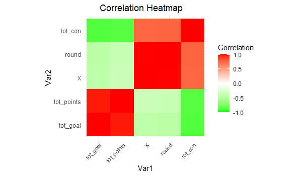
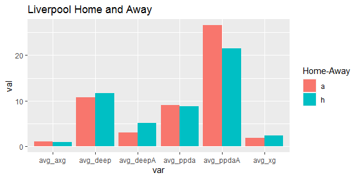
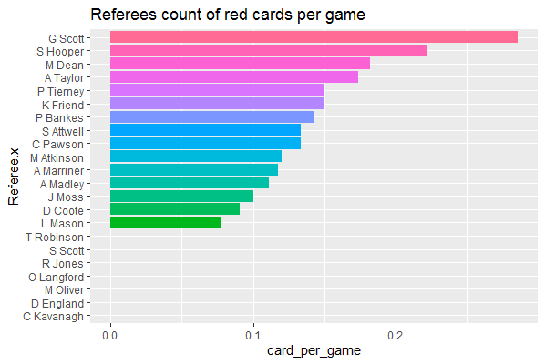
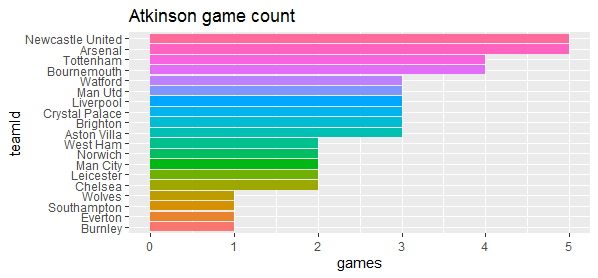

# English-Premier-League-2019-2020-EDA

## Projcet Overview

he english premier league 2019/20 season was 29 games in when it was abruptly cut short by the covid-19 pandemic. Although some would say that by this time the tittle holder was already known and that handing over the cup was the only thing left , there was still much to play for.The top 4 spots and relegation battle were really interesting.

We will work with the data that we have and visualize some statistics throughout the season.

## Objectives

We will answer some few questions like

  * Does home vs away really matter?

## EDA

Here are some of the visualizations I made

